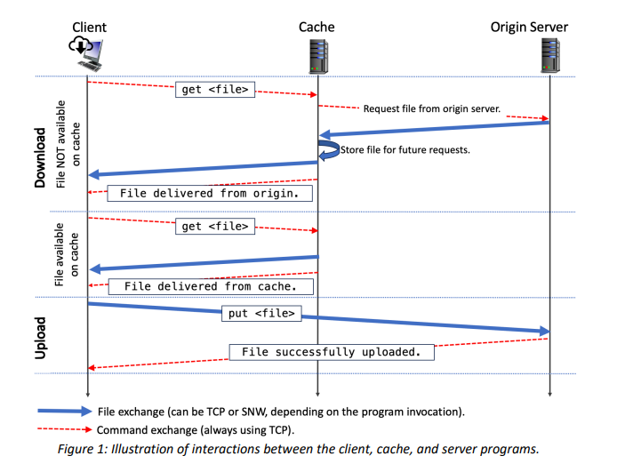

# CacheSync

## Project Description

This project consists of a file upload and download application with three main components: a client, a server, and a cache. The application supports file transfers using two transport protocols: TCP and stop-and-wait (SNW) over UDP. The goal of this project is to practice Application and Transport Layer skills by implementing (i) a cache service for file exchange, and (ii) two reliable data transport protocols.

1. Client: Initiates file upload and download requests.
2. Server: Receives file uploads from the client and stores files.
3. Cache: Stores files locally and provides them to clients if available; otherwise, fetches them from the server.

### Features

1. Upload: Upload files from client to server.
2. Download: Download files from cache (if available) or from server.
3. Quit: Exit the application.

### Installation

1. Clone the Repository

git clone https://github.com/keerthireddytummalapelly/CacheSync.git

2. Ensure Python is installed. The project uses standard libraries, so no additional packages are required.

### Usage

1. Starting the Server

Command : python server.py `<port>` `<protocol>`

`<port>`: Port number on which the server will listen.

`<protocol>`: Transport protocol (tcp or snw).

2. Starting the Cache

Command : python cache.py `<port>` `<server-ip>` `<server-port>` `<protocol>`

`<port>`: Port number for the cache. 

`<server-ip>`: IP address of the server.

`<server-port>`: Port number of the server.

`<protocol>`: Transport protocol (tcp or snw).

3. Starting the Client

Command: python client.py `<server-ip>` `<server-port>` `<cache-ip>` `<cache-port>` `<protocol>`

`<server-ip>`: IP address of the server. 

`<server-port>`: Port number of the server. 

`<cache-ip>`: IP address of the cache.

`<cache-port>`: Port number of the cache.

`<protocol>`: Transport protocol (tcp or snw).

### Commands

1. Upload file - put `<file>`
2. Download file - get `<file>`
3. Quit - quit

### Testing

1. Run the server and cache on separate terminals or machines.
2. Start the client and test file uploads and downloads.
3. Check responses and ensure that files are correctly uploaded/downloaded.
